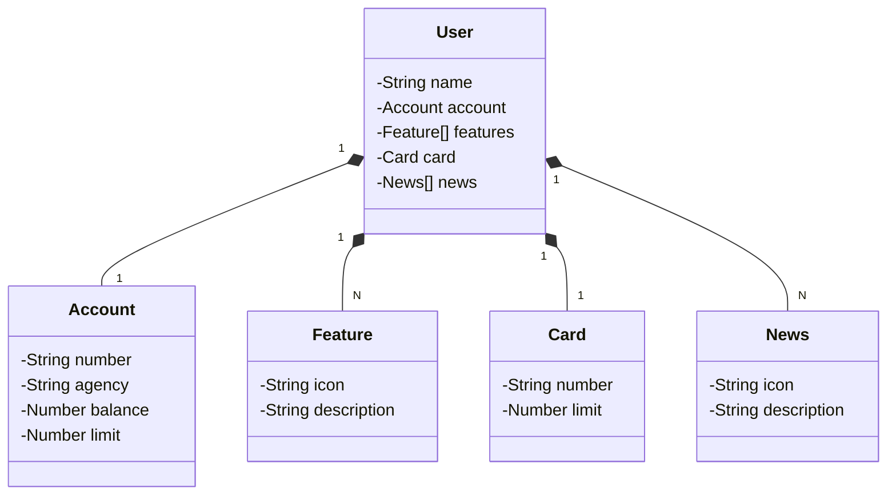

#### :dollar: Santander Bootcamp 2023 - Backend Java.

<ol align="left">
 <li><strong><a href="#--sobre-o-projeto">Sobre</a></strong></li>
 <li><strong><a href="#--tecnologias">Tecnologias</a></strong></li>
 <li><strong><a href="#--aprendizados-back-end">Aprendizados Back-end</a></strong></li>
</ol>

🌎 **Projeto:**

 

###  🔥 Sobre o projeto

Java RESTful API criada para a Santander Dev Week. em 10/2023.

 

## [Link do spring.io](https://start.spring.io/)
## [Link do Figma](https://www.figma.com/file/0ZsjwjsYlYd3timxqMWlbj/SANTANDER---Projeto-Web%2FMobile?type=design&node-id=1421%3A432&mode=design&t=6dPQuerScEQH0zAn-1)
## [Link do json editor online](https://jsoneditoronline.org/#left=local.colane)
## [Link do Chat GPT](https://chat.openai.com/auth/login)
## [Link do mermaid](https://mermaid.js.org/syntax/classDiagram.html)
## [Link do APP](http://localhost:8080/swagger-ui/index.html)

O Figma foi utilizado para a abstração do domínio desta API, sendo útil na análise e projeto da solução.

 

### :space_invader: Modelo de dados

## Diagrama de Classes (Domínio da API)

 

###  🤖 Tecnologias

- **Java 17**
- **Spring Boot**
- **Hibernate JPA**
- **H2 Database**
- **PostgreSQL**
- **Postman**
- **intellij idea**
- **Eclipse**

###  🎉 Aprendizados Back-end

- Modelo de domínio
- Acesso a banco de dados
- Estruturar o back end no padrão camadas
  - Controllers
  - Domain
  - Services
  - Repositories
- Criar endpoints da API REST

###  💎 Autor

<a href="">
 
 
<strong>Wagner Miyamoto</strong></a>

 